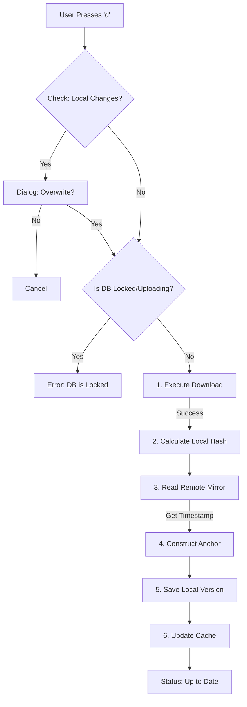

# Download Workflow

This document explains the process of downloading a database from the remote B2 bucket to the local machine. It mirrors the `rclone copy` logic but ensures safety checks.

## Process Flow

The download process is executed by `DownloadDatabase` in `core/download.go`.

> **UI Action**: This workflow is triggered when the user presses **'d'** (or selects "Download") in the main dashboard.

### Phase 0: Pre-Flight Validation

Before starting, `core.ValidateAction` enforces safeguards.

- **Local Changes Warning**: If status is "Ready To Upload" (Local Ahead / New Local), the UI warns the user: **"Overwrite local changes?"**. The user must confirm to proceed.
- **Concurrent Update Warning**: If the database is locked by another user and marked as **"Updating"** or **"Uploading"**, the system warns: **"This database is currently being updated... Are you sure?"**.

### Phase 1: Lock Check & Safety

1.  **Check Locks**: Queries B2 locks to ensure no one is currently uploading this database.
2.  **Abort**: If locked (uploading), the download terminates to prevent fetching a partially uploaded (corrupted) file.

### Phase 2: Execute Download

1.  **Command**: Executes `rclone copy remote:path local:dir`.
2.  **Safety**: Overwrites the local file with the version from B2.

### Phase 3: Construct Verified Anchor

Once the download is successful, we anchor the local state to the remote state.

1.  **Construct Anchor**: The system calculates the SHA256 of the newly downloaded file.
2.  **Fetch Remote Context**: Reads the latest metadata from the local mirror (`db/all_dbs/.b2m/version/`) to get the `Timestamp` and `Uploader`.
3.  **Construct Anchor**: Creates a new metadata object combining the **Local Hash** + **Remote Timestamp**.
4.  **Save**: Writes to `local-versions/`.
5.  **Update Cache**: The persistent `hash.json` cache is updated with the new file's hash and statistics.
6.  **Result**: Status becomes **"Up to Date ✅"**.

## Diagram

