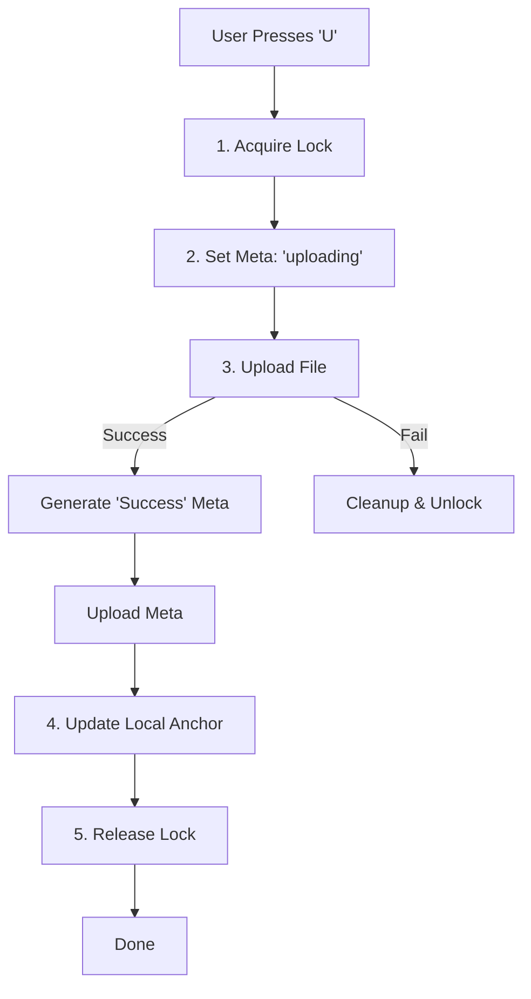

# Upload Workflow

This document details the multi-step process required to safely upload a database to the remote B2 bucket. This flow ensures exclusive access, validation, and proper audit trails.

## Process Flow

The upload process is orchestrated by `PerformUpload` in `core/upload.go`.

> **UI Action**: This workflow is triggered when the user presses **'U'** (or selects "Upload") in the main dashboard.

### Phase 1: Locking (Signal Intent)

1.  **Acquire Lock**: Creates a `.lock` file on B2 (`dbname.user.host.lock`).
2.  **Purpose**: Signals to other users that an upload is starting. Prevention of concurrent edits.

### Phase 2: Metadata Status Update

1.  **Set Status**: Proactively updates the remote metadata JSON to `status: "uploading"`.
2.  **UI Feedback**: Allows other users to see **"User is Uploading ⬆️"** instead of just "Locked".

### Phase 3: Uploading & Metadata Finalization

1.  **File Upload**: Executes `rclone copy` to transmit the `.db` file to B2.
2.  **Verification**: Checks checksums to ensure integrity.
3.  **Generate Final Metadata**: On success, generates a new metadata block with `status: "success"` and interaction history.
4.  **Upload Metadata**: Syncs the new metadata file to B2.

### Phase 4: Anchor Update

1.  **Sync Local State**: Updates the `local-versions/` anchor file with the metadata just uploaded.
2.  **Result**: Ensures the system knows the local file is now identical to the remote (Status becomes "Synced").

### Phase 5: Finalization

1.  **Unlock**: Removes the `.lock` file from B2.
2.  **Notify**: Sends a completion webhook (e.g. Discord).

## Diagram

