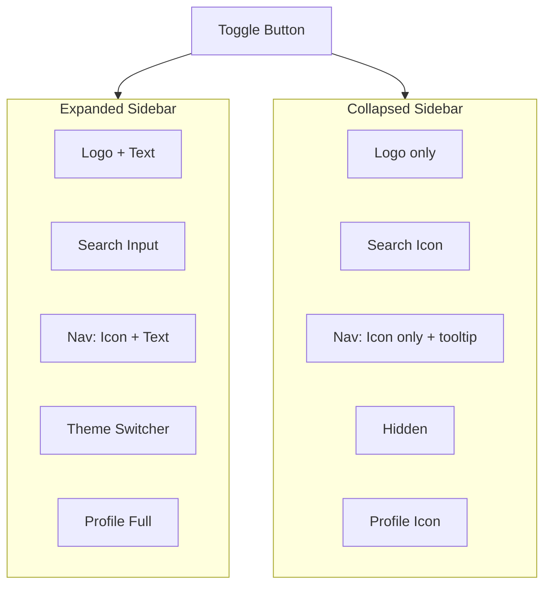

# Collapsible Sidebar Implementation

## Current Architecture

- **Sidebar**: [components/common/sidebar.templ](components/common/sidebar.templ) - static 14rem width, contains SearchBar, nav links (icon + text), SidebarThemeSwitcher, SidebarProfile
- **Search flow**: Typing in `#search` input updates `window.searchState` and hash `#search?q=...`. Base layout's `toggleSearchView()` shows search overlay when hash is `#search?q=` (even empty)
- **Ctrl+K**: Sidebar handler (lines 569-582) focuses `#sidebar #search` on non-homepage; index.templ focuses homepage search
- **SidebarProfile**: React component mounted in `#sidebar-profile-container`, shows user/sign-in with avatar + text

## Implementation Plan

### 1. State and Toggle Button

- Add `sidebar-collapsed` class to `#sidebar` when collapsed; persist state in `localStorage` (e.g. `fdt-sidebar-collapsed`)
- Add collapse/expand toggle button (chevron or panel icon) - positioned after logo in expanded mode, visible in both modes
- Collapsed width: ~4rem (64px) for icon-only layout; expanded: 14rem (unchanged)
- Animate width transition via CSS

### 2. Collapsed Layout Structure

**Logo section**: Show only logo image (32px), hide title/subtitle. Wrap in same homepage link. Toggle button next to it.

**Search section**: 

- Expanded: Keep current SearchBar (input visible)
- Collapsed: Replace with search icon button. On click: set `window.location.hash = '#search?q='`, `window.searchState.setQuery('')` to open search overlay directly (no focus on hidden input)

**Nav section**: In collapsed mode, hide all `<span>` text nodes; show only icons. Each nav item becomes icon-only with `title` attribute for native tooltip (or use a small tooltip lib if needed - native `title` is simplest). Preserve existing `href` and click behavior.

**Theme section**: Hide `#sidebar-theme-switcher-section` when collapsed (CSS or JS based on `sidebar-collapsed`)

**Profile section**: SidebarProfile needs collapsed variant:

- Option A: Pass `collapsed` prop via data attribute from templ, SidebarProfile reads it and renders icon-only (avatar or sign-in icon)
- Option B: In collapsed mode, hide profile container and show minimal icon - requires coordination between templ (hiding container) and possibly a separate icon
- Simplest: In collapsed mode, hide `#sidebar-profile-container` entirely, or render a compact icon that links to /pro or triggers sign-in. Recommend: Show avatar/sign-in icon only with tooltip "Sign In" or user name.

### 3. Ctrl+K Behavior

Modify the Ctrl+K handler in [sidebar.templ](components/common/sidebar.templ) (lines 569-582):

```javascript
// When collapsed: open search popup directly (set hash + searchState)
// When expanded: focus sidebar #search (current behavior)
```

Check for `#sidebar.sidebar-collapsed` - if true, call `openSearchPopup()` instead of focusing input. The search_bar.templ also has a global Ctrl+K - we need a single source of truth. Recommendation: Centralize Ctrl+K in base_layout or have sidebar handler take precedence when sidebar is visible and collapsed.

**Order of handlers**: index.templ (homepage) has its own handler. For non-homepage: sidebar.templ handler runs. Update sidebar handler to:

- If homepage: do nothing (index handles it)
- If non-homepage + sidebar collapsed: `e.preventDefault()`, set hash `#search?q=`, `searchState.setQuery('')`
- If non-homepage + sidebar expanded: focus `#sidebar #search`

The search_bar.templ attaches to `document` - so both fire. We need the sidebar handler to run first and `preventDefault` + return when collapsed, so search_bar doesn't try to focus (and fail since input may be hidden). Use `stopImmediatePropagation` or check collapsed state in a unified handler.

### 4. Tooltips

Add `title` attribute to each nav link with the text content:

- "VS Code extension", "My Bookmarks", "Pro", "Tools", "Installerpedia", "Emojis", "SVG Icons", "PNG Icons", "MCP", "TLDR", "Man Pages", "Cheatsheets"

For collapsed search icon button: `title="Search (Ctrl+K)"`

### 5. Files to Modify


| File                                                                | Changes                                                                                                                                                                        |
| ------------------------------------------------------------------- | ------------------------------------------------------------------------------------------------------------------------------------------------------------------------------ |
| [sidebar.templ](components/common/sidebar.templ)                    | Add collapse state, toggle button, collapsed layout (hide text/spans, replace search with icon), CSS for collapsed width, update hideSidebarSearch for collapsed, Ctrl+K logic |
| [SidebarProfile.tsx](frontend/components/common/SidebarProfile.tsx) | Accept collapsed prop (via container data attribute or React context) and render icon-only variant with tooltip                                                                |
| [search_bar.templ](components/common/search_bar.templ)              | May need to support "collapsed sidebar" mode - or sidebar uses a different structure when collapsed and doesn't include SearchBar, instead has custom icon button              |


### 6. SearchBar in Collapsed Mode

The SearchBar is one component. For collapsed sidebar we have two options:

**A)** Keep SearchBar in DOM but hide `#desktop-search-container` and show a new `#sidebar-search-icon-btn` when collapsed. The templ would conditionally render both; CSS/JS shows one based on collapsed state.

**B)** Create a `SidebarSearch` component or block in sidebar.templ that:

- Expanded: renders `@SearchBar()` 
- Collapsed: renders icon button that opens popup

Since SearchBar is shared and has complex logic, option A is cleaner: add a sibling icon button in `#sidebar-search-section`, hide it when expanded and hide SearchBar when collapsed. Wire the icon click to open popup.

### 7. CSS Structure

```css
#sidebar { transition: width 0.2s; }
#sidebar.sidebar-collapsed { width: 4rem !important; }
#sidebar.sidebar-collapsed #sidebar-logo-text-container,
#sidebar.sidebar-collapsed .nav-link-text span,
#sidebar.sidebar-collapsed #sidebar-theme-switcher-section,
#sidebar.sidebar-collapsed #desktop-search-container { display: none !important; }
#sidebar.sidebar-collapsed #sidebar-search-icon-btn { display: flex !important; }
```

### 8. SidebarProfile Collapsed

SidebarProfile is rendered by `window.renderTool('sidebarProfile', 'sidebar-profile-container')`. The parent div can have `data-collapsed="true"` when collapsed. SidebarProfile reads `document.getElementById('sidebar-profile-container')?.closest('#sidebar')?.classList.contains('sidebar-collapsed')` on mount and when receiving a custom event `sidebar-collapsed-changed`. Or simpler: pass nothing and have SidebarProfile check `#sidebar.sidebar-collapsed` in a `useEffect` + `ResizeObserver`/`MutationObserver` - overkill. 

Simpler: Dispatch `sidebar-collapsed-changed` when toggle is clicked; SidebarProfile listens and re-renders. Or use a data attribute on the container that the parent updates - React would need to re-mount or receive new props. Easiest: Put a class on `#sidebar-profile-container` when collapsed, and use CSS to hide text and show icon-only. But SidebarProfile is React - its DOM is managed by React. So we need React to know about collapsed state.

**Approach**: Add `window.sidebarCollapsed = true/false` or dispatch `sidebar-collapsed-changed` with `detail: { collapsed: true }`. SidebarProfile subscribes and sets local state to re-render icon-only layout.

### 9. Edge Cases

- **Mobile**: Current responsive layout hides sidebar by default, shows as overlay. Collapse/expand is desktop-only - on mobile keep current overlay behavior. Add `@media (min-width: 1024px)` guard so collapse UI only appears on desktop.
- **Homepage**: Sidebar search is already hidden on homepage (`hideSidebarSearch`). In collapsed mode, the search icon should still show and open popup when clicked.
- **Hash changes**: When user opens search via collapsed icon, hash becomes `#search?q=`, which triggers `toggleSearchView` - good.

## Diagram




