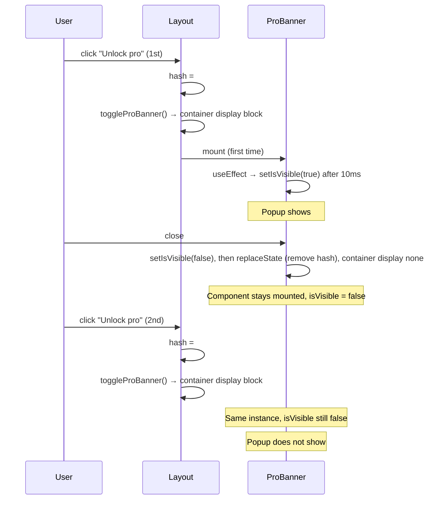

# Pro banner re-open fix

## Root cause

- **Layout** ([base_layout.templ](components/layouts/base_layout.templ)): on `hashchange`/load it runs `toggleProBanner()` and sets `#pro-banner-container` to `display: block` only when hash is `#pro-banner` or `buy=pro`. It loads and mounts ProBanner once (`proBannerMounted`); it never unmounts.
- **ProBanner** ([ProBanner.tsx](frontend/components/common/ProBanner.tsx)): `isVisible` is set to `true` only in a single `useEffect` on mount (setTimeout 10ms). On close it sets `isVisible = false`, clears hash, and hides the container. The React tree stays mounted.
- So when the user opens again via hash, the container becomes visible but the same ProBanner instance still has `isVisible === false` and never receives a signal to show again.

---

## Option A – Minimal fix (recommended)

Keep the current URL-based trigger; make ProBanner react to the URL whenever it says “show”.

**Changes:**

1. **ProBanner.tsx**
  - Add a `useEffect` that:
    - Subscribes to `hashchange` and `popstate`.
    - In the handler (and once on mount), if `window.location.hash === '#pro-banner'` or `new URLSearchParams(window.location.search).get('buy') === 'pro'`, call `setIsVisible(true)`.
  - No change to close behavior (keep clearing hash and hiding container).

Result: First open = mount + 10ms → visible. Close = hidden + hash cleared. Second open = hash set → layout shows container, ProBanner’s listener runs → `setIsVisible(true)` → popup shows. No localStorage, no changes to layout or other entry points.

---

## Option B – Event-based revamp

Decouple “show banner” from the URL: use a custom event to open, keep URL as optional for sharing.

**Flow:**

1. **Open**: All entry points dispatch a custom event (e.g. `window.dispatchEvent(new CustomEvent('openProBanner'))`) instead of (or in addition to) setting `window.location.hash = '#pro-banner'`.
  - Entry points: [components/pages/index.templ](components/pages/index.templ) (explore-pro-benefits-btn), [ProSearchPage.tsx](frontend/components/search/ProSearchPage.tsx) (“X left” link), [SearchPage.tsx](frontend/components/search/SearchPage.tsx) (unlock pro).
2. **Layout (base_layout.templ)**:
  - On load: keep current logic for `buy=pro` and `#pro-banner` so direct links still work.
  - Add listener for `openProBanner`: set container `display: block`, ensure module loaded, optionally set `location.hash = '#pro-banner'` for shareability.
  - `toggleProBanner()` remains for initial load and hashchange; no need to change auto-show logic.
3. **ProBanner.tsx**:
  - Listen for `openProBanner`: call `setIsVisible(true)`.
  - On mount, if container is visible (e.g. hash or buy param), set `isVisible` true (current 10ms mount effect already handles first open).
  - Close: same as now (clear hash, hide container).

**Pros**: Re-open is driven by event, not hash; no “same hash so no hashchange” issue. **Cons**: More files to touch; all “open” call sites must use the event (or both event + hash for compatibility).

---

## Recommendation

- **Option A** fixes the bug with a small, localized change in ProBanner only.
- **Option B** is useful if you want open/close to be fully independent of the URL and don’t mind updating every “Unlock pro” trigger to use the event.

Implementing Option A first is the easiest way to solve “popup not coming the second time”; Option B can be done later if you want to revamp the trigger mechanism.